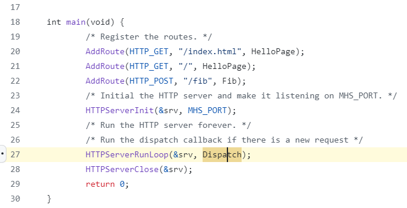

link:https://github.com/starnight/MicroHttpServer/issues/5
CSA can not detect this vulnerability becasue
1. CSA does not support any kind of function pointer, even it is a simple one and have no alias.
   this is the CFG extracted by CSA, we can see, it can not detect the control flow to function
   
