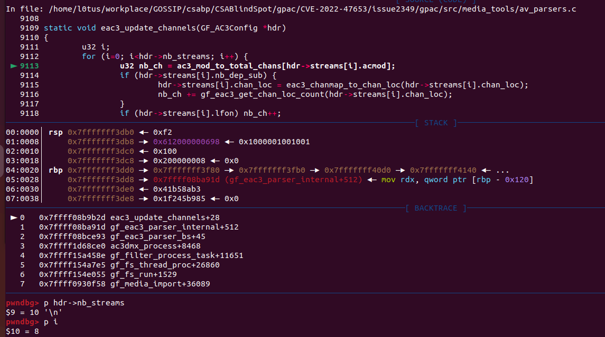

> link: https://github.com/gpac/gpac/issues/2349
This issue was signed as CVE-2022-47653

in media_tools/av_parsers.c:9113:
```c
9109    static void eac3_update_channels(GF_AC3Config *hdr)
9110    {
9111	    u32 i;
9112	    for (i=0; i<hdr->nb_streams; i++) {
9113		    u32 nb_ch = ac3_mod_to_total_chans[hdr->streams[i].acmod];
9114	        if (hdr->streams[i].nb_dep_sub) {
9115	            hdr->streams[i].chan_loc = eac3_chanmap_to_chan_loc(hdr->streams[i].chan_loc);
9116	            nb_ch += gf_eac3_get_chan_loc_count(hdr->streams[i].chan_loc);
9117	        }
9118	        if (hdr->streams[i].lfon) nb_ch++;
9119	        hdr->streams[i].channels = nb_ch;
9120	        hdr->streams[i].surround_channels = ac3_mod_to_surround_chans[hdr->streams[i].acmod];
9121        }
9122    }
```

Absense of any checks for input structure hdr will lead to an Out-Of-Bound error.



backtrace:
```
 ► 0   0x7ffff08b9b2d eac3_update_channels+28
   1   0x7ffff08ba91d gf_eac3_parser_internal+512
   2   0x7ffff08bce93 gf_eac3_parser_bs+45
   3   0x7ffff1d68ce0 ac3dmx_process+8468
   4   0x7ffff15a458e gf_filter_process_task+11651
   5   0x7ffff154a7e5 gf_fs_thread_proc+26860
   6   0x7ffff154e055 gf_fs_run+1529
   7   0x7ffff0930f58 gf_media_import+36089
```