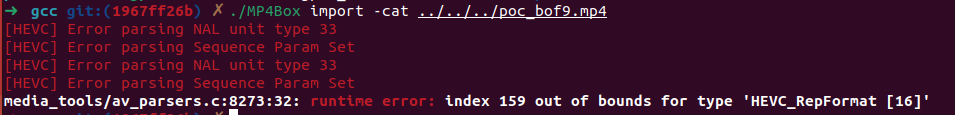

> link: https://github.com/gpac/gpac/issues/2353

This issue is signed as [CVE-2022-47657](https://cve.mitre.org/cgi-bin/cvename.cgi?name=CVE-2022-47657)
This bug exists in /media_tools/av_parsers.c:8273


```c
8258    if (multiLayerExtSpsFlag) {
8259		sps->update_rep_format_flag = gf_bs_read_int_log(bs, 1, "update_rep_format_flag");
8260		if (sps->update_rep_format_flag) {
8261			sps->rep_format_idx = gf_bs_read_int_log(bs, 8, "rep_format_idx");
8262			if (sps->rep_format_idx>15) {
8263				return -1;
8264			}
8265		} else {
8266			if (layer_id<MAX_LHVC_LAYERS) {
8267				u32 idx = vps->layer_id_in_vps[layer_id];
8268				if (idx>15)
8269					return -1;
8270				sps->rep_format_idx = vps->rep_format_idx[idx];
8271			}
8272		}
8273		sps->width = vps->rep_formats[sps->rep_format_idx].pic_width_luma_samples;
8274		sps->height = vps->rep_formats[sps->rep_format_idx].pic_height_luma_samples;
8275		sps->chroma_format_idc = vps->rep_formats[sps->rep_format_idx].chroma_format_idc;
8276		sps->bit_depth_luma = vps->rep_formats[sps->rep_format_idx].bit_depth_luma;
8277		sps->bit_depth_chroma = vps->rep_formats[sps->rep_format_idx].bit_depth_chroma;
8278		sps->separate_colour_plane_flag = vps->rep_formats[sps->rep_format_idx].separate_colour_plane_flag;
8279
8280		//TODO this is crude ...
8281		sps->ptl = vps->ext_ptl[0];
8282	}
```

The definition of HEVC_VPS structure is in media_dev.h:471
```c
typedef struct
{
	s32 id;
	/*used to discard repeated SPSs - 0: not parsed, 1 parsed, 2 stored*/
	u32 state;
	s32 bit_pos_vps_extensions;
	u32 crc;
	Bool vps_extension_found;
	u32 max_layers, max_sub_layers, max_layer_id, num_layer_sets;
	Bool temporal_id_nesting;
	HEVC_ProfileTierLevel ptl;

	HEVC_SublayerPTL sub_ptl[8];
	//this is not parsed yet (in VPS VUI)
	HEVC_RateInfo rates[8];


	u32 scalability_mask[16];
	u32 dimension_id[MAX_LHVC_LAYERS][16];
	u32 layer_id_in_nuh[MAX_LHVC_LAYERS];
	u32 layer_id_in_vps[MAX_LHVC_LAYERS];

	u8 num_profile_tier_level, num_output_layer_sets;
	u32 profile_level_tier_idx[MAX_LHVC_LAYERS];
	HEVC_ProfileTierLevel ext_ptl[MAX_LHVC_LAYERS];

	u32 num_rep_formats;
	HEVC_RepFormat rep_formats[16];
	u32 rep_format_idx[16];
	Bool base_layer_internal_flag, base_layer_available_flag;
	u8 num_layers_in_id_list[MAX_NUM_LAYER_SETS];
	u8 direct_dependency_flag[MAX_LHVC_LAYERS][MAX_LHVC_LAYERS];
	Bool output_layer_flag[MAX_LHVC_LAYERS][MAX_LHVC_LAYERS];
	u8 profile_tier_level_idx[MAX_LHVC_LAYERS][MAX_LHVC_LAYERS];
	Bool alt_output_layer_flag[MAX_LHVC_LAYERS];
	u8 num_necessary_layers[MAX_LHVC_LAYERS];
	Bool necessary_layers_flag[MAX_LHVC_LAYERS][MAX_LHVC_LAYERS];
	u8 LayerSetLayerIdList[MAX_LHVC_LAYERS][MAX_LHVC_LAYERS];
	u8 LayerSetLayerIdListMax[MAX_LHVC_LAYERS]; //the highest value in LayerSetLayerIdList[i]
} HEVC_VPS;
```

The check for "sps->rep_format_idx" is inefficient enough, which can be bypassed with followiing steps:
1. First time call function `gf_hevc_read_sps_bs_internal()` with `sps->update_rep_format_flag == 1`
2. Since 1, we update the `sps->rep_format_flag` to 1 by function `gf_bs_read_int_log(bs, 8, "rep_format_idx")`
3. Then update the `sps->rep_format_idx` to 159 by function `gf_bs_read_int_log(bs, 8, "rep_format_idx");`, and the `if` judgement will eventually `return -1`
4. Second time enter this function `gf_hevc_read_sps_bs_internal()`, with the `sps->update_rep_format_flag == 0` , and make sure `!(layer_id < MAX_LHVC_LAYERS)`, thus we can bypass all the `if` judgement and keep the `sps->rep_format_idx` equals to 159. And the program continues run till line 8273.
5. And finally trigger the oob with `sps->width = vps->rep_formats[sps->rep_format_idx].pic_width_luma_samples;`. (The rep_formats[] is an array with the range of 16 and the sps->rep_format_idx is 159)

However CSA can not recognize this bug might because the nested `if()` judgments and the sentences in `if()` might not be recognized.