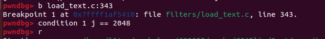
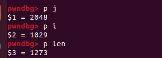
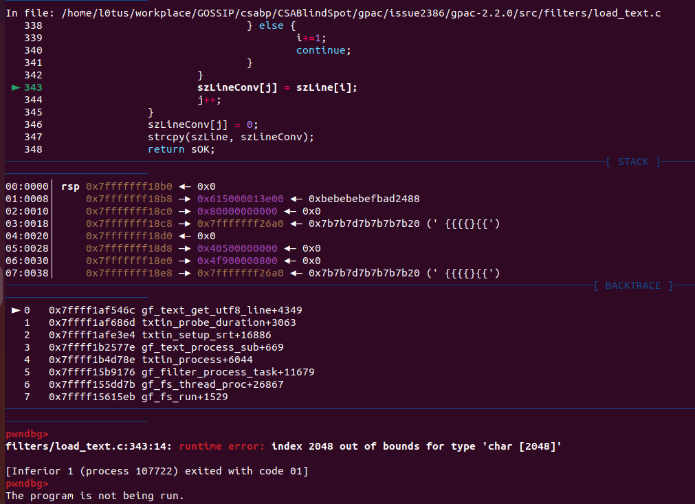
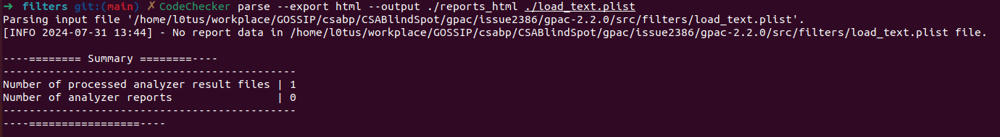

This issue was assigned CVE-2023-1452.
link: https://github.com/gpac/gpac/issues/2386
Buffer overflow in filters/load_text.c:353:14 

```c
char *gf_text_get_utf8_line(char *szLine, u32 lineSize, FILE *txt_in, s32 unicode_type)
{
	u32 i, j, len;
	char *sOK;
	char szLineConv[2048];
	unsigned short *sptr;

	memset(szLine, 0, sizeof(char)*lineSize);
	sOK = gf_fgets(szLine, lineSize, txt_in);
	if (!sOK) return NULL;
	if (unicode_type<=1) {
		j=0;
		len = (u32) strlen(szLine);
		for (i=0; i<len; i++) {
			if (!unicode_type && (szLine[i] & 0x80)) {
				/*non UTF8 (likely some win-CP)*/
				if ((szLine[i+1] & 0xc0) != 0x80) {
					szLineConv[j] = 0xc0 | ( (szLine[i] >> 6) & 0x3 );
					j++;
					szLine[i] &= 0xbf;
				}
				/*UTF8 2 bytes char*/
				else if ( (szLine[i] & 0xe0) == 0xc0) {
					szLineConv[j] = szLine[i];
					i++;
					j++;
				}
				/*UTF8 3 bytes char*/
				else if ( (szLine[i] & 0xf0) == 0xe0) {
					szLineConv[j] = szLine[i];
					i++;
					j++;
					szLineConv[j] = szLine[i];
					i++;
					j++;
				}
				/*UTF8 4 bytes char*/
				else if ( (szLine[i] & 0xf8) == 0xf0) {
					szLineConv[j] = szLine[i];
					i++;
					j++;
					szLineConv[j] = szLine[i];
					i++;
					j++;
					szLineConv[j] = szLine[i];
					i++;
					j++;
				} else {
					i+=1;
					continue;
				}
			}
			szLineConv[j] = szLine[i]; //line343
			j++;
		}
		szLineConv[j] = 0;
		strcpy(szLine, szLineConv);
		return sOK;
	}

#ifdef GPAC_BIG_ENDIAN
	if (unicode_type==3)
#else
	if (unicode_type==2)
#endif
	{
		i=0;
		while (1) {
			char c;
			if (!szLine[i] && !szLine[i+1]) break;
			c = szLine[i+1];
			szLine[i+1] = szLine[i];
			szLine[i] = c;
			i+=2;
		}
	}
	sptr = (u16 *)szLine;
	i = gf_utf8_wcstombs(szLineConv, 2048, (const unsigned short **) &sptr);
	if (i == GF_UTF8_FAIL) i = 0;
	szLineConv[i] = 0;
	strcpy(szLine, szLineConv);
	/*this is ugly indeed: since input is UTF16-LE, there are many chances the gf_fgets never reads the \0 after a \n*/
	if (unicode_type==3) gf_fgetc(txt_in);
	return sOK;
}
```
This function is ultilized to read text from a file and convert them to utf-8 code.
The length of array szLineConv[] is 2048.
And the variable "len" is from the length of (char*)szLine. The poc offered a szLine with the length of 1273. And the operation is handled in a loop (i = 0; i < len; i++). Which will eventually lead to a situation that variable j become out of the range 0 ~ 2047.






However, CSA can not recognize this bug.
We tried to implement CSA with the command below:
```sh
clang --analyze -Xclang -analyzer-config -Xclang aggressive-binary-operation-simplification=true,unroll-loops=true -Xclang -analyzer-checker=alpha.security.ArrayBound -Xclang -analyzer-checker=alpha.unix.cstring.OutOfBounds -Xclang -analyzer-inline-max-stack-depth -Xclang 10 -Xclang -analyzer-max-loop -Xclang 1500 ./load_text.c
```


