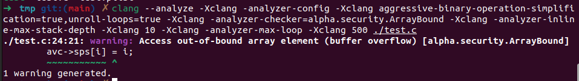

> Link:https://github.com/gpac/gpac/issues/2366

The bug exists in /src/media_tools/av_parsers.c:5684 in function avc_parse_slice


```c
5679    pps_id = gf_bs_read_ue_log(bs, "pps_id");
5680	if ((pps_id<0) || (pps_id > 255)) return -1;
5681	si->pps = &avc->pps[pps_id];
5682	if (!si->pps->slice_group_count) return -2;
5683	if (si->pps->sps_id>=255) return -1;
5684	si->sps = &avc->sps[si->pps->sps_id];
```

The type of variable sps is sps is AVC_SPS, which is defined in /include/internal/media_dev.h

```c
typedef struct
{
	AVC_SPS sps[32]; /* range allowed in the spec is 0..31 */
	s8 sps_active_idx, pps_active_idx;	/*currently active sps; must be initalized to -1 in order to discard not yet decodable SEIs*/

	AVC_PPS pps[255];

	AVCSliceInfo s_info;
	AVCSei sei;

	Bool is_svc;
	u8 last_nal_type_parsed;
	s8 last_ps_idx, last_sps_idx;
} AVCState;
```

The sps has the range of 32, but in program it's judged with the range of 255(which is the range of pps array)

However CSA can't report this bug because of the nested structures


Even if we test this kind of bug in a simple program with a naive structure, CSA still can not detect this bug.
test.c:
```c
#include<stdio.h>
#include<stdlib.h>

typedef struct
{
	int sps[32]; /* range allowed in the spec should be 0..31 */
    int sensitive; // shall not be modified
	int sps_id[255]; /* range allowed in the spec should be 0..255 */

} AVCState;

int main()
{
    AVCState *avc = (AVCState *)malloc(sizeof(AVCState));
    avc->sensitive = 0;
    int i;
    scanf("%d", &i);
    if( i >= 255)
    {
        exit(0);
    }
    avc->sps[i] = i;
    printf("success, avc->sps[%d] = %d\n",i , avc->sps[i]);

    printf("avc->sensitive = %d\n", avc->sensitive);
    for(i=0; i<255; i++)
    {
        avc->sps_id[i] = i;
    }
    return 0;
}
```


